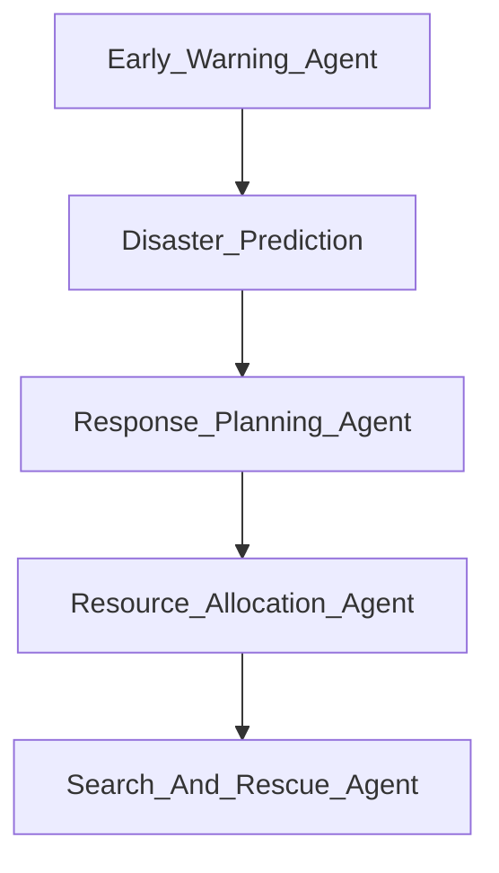

# Chapter 11: Case Studies in AI Agent Applications

This chapter explores real-world implementations of AI agents across various industries, demonstrating their impact and capabilities in solving complex problems. The focus is on **multi-agent collaboration**, where AI systems work together autonomously to enhance efficiency and decision-making.

---

## **11.1 AI Agents in Software Development**

### **Cursor.ai: Multi-Agent AI for Coding Assistance**
**Cursor.ai** is revolutionizing software development by embedding multiple AI agents directly into developer workflows. It provides:
- **Code Generation Agent** – Suggests code snippets and full implementations based on project context.
- **Debugging Agent** – Automatically detects and fixes errors in the code.
- **Refactoring Agent** – Optimizes code structure and improves maintainability.

By leveraging multi-agent collaboration, Cursor.ai streamlines the development process, allowing teams to integrate AI-driven workflows seamlessly.

### **GitHub Copilot & Claude API in Code Assistance**
- **GitHub Copilot**, powered by OpenAI Codex, assists developers by:
  - Generating entire code blocks based on natural language prompts.
  - Suggesting real-time solutions within IDEs like VS Code.
- **Claude API for Developer Support**:
  - Anthropic’s Claude AI enhances software debugging with structured explanations.
  - AI-assisted documentation and code review support for development teams.

### **Code Interpreter AI Agents**
Emerging AI-driven code interpreters allow developers to:
- Automate testing and debugging of software applications.
- Generate and execute scripts dynamically within secure environments.
- Optimize computational workflows using AI-based heuristics.

---

## **11.2 AI Agents in Healthcare**

### **Collaborative AI in Diagnosis & Treatment**
AI-powered diagnostic systems work as a **team of agents**:
- **Image Analysis Agent** – Scans X-rays, MRIs, and CT scans for anomalies.
- **Prediction Agent** – Uses historical data to forecast disease progression.
- **Treatment Recommendation Agent** – Suggests personalized treatment options based on patient history.

### **Multi-Agent Virtual Assistants for Patient Care**
AI-driven virtual assistants enhance patient care by:
- **Symptom Assessment Agent** – Gathers patient-reported symptoms and suggests next steps.
- **Scheduling Agent** – Books appointments and handles follow-ups.
- **Health Monitoring Agent** – Tracks real-time vitals and sends alerts for medical emergencies.

The integration of these agents **reduces hospital workloads**, ensuring personalized and efficient patient care.

---

## **11.3 AI Agents in Finance**

### **Multi-Agent Algorithmic Trading & Risk Management**
Financial institutions utilize AI agents to:
- **Market Analysis Agent** – Monitors real-time stock trends and macroeconomic signals.
- **Trading Execution Agent** – Automates high-frequency trading strategies.
- **Risk Management Agent** – Assesses potential financial risks and suggests risk mitigation strategies.

### **Banking AI Agents for Customer Support**
AI-powered banking chatbots use a **multi-agent architecture**:
- **Fraud Detection Agent** – Scans transactions for anomalies and alerts security teams.
- **Financial Planning Agent** – Provides users with budget recommendations.
- **Customer Service Agent** – Handles queries related to loans, credit scores, and transactions.

The use of AI in finance has **improved security, efficiency, and accessibility** in financial operations.

---

## **11.4 AI Agents in Autonomous Systems**

### **Self-Driving Vehicles and Coordinated AI Agents**
AI agents in autonomous vehicles work in tandem to ensure safe and efficient driving:
- **Perception Agent** – Processes LiDAR, camera, and sensor data.
- **Decision-Making Agent** – Determines real-time navigation paths.
- **Communication Agent** – Coordinates with other vehicles for traffic management.

### **AI Agents in Industrial Automation**
AI-driven robotic systems use **hierarchical agent models** for industrial tasks:
- **Quality Control Agent** – Detects defects in manufacturing processes.
- **Supply Chain Optimization Agent** – Predicts demand and manages logistics.
- **Human-Collaborative Robotics** – AI-powered robots assist human workers in assembly lines.

---

## **11.5 AI Agents in Scientific Research**

### **AI for Scientific Simulations & Lab Automation**
AI agents are increasingly used in research to assist with complex problem-solving:
- **Drug Discovery Agent** – Simulates chemical interactions to find new drug candidates.
- **Climate Modeling Agent** – Analyzes environmental data for predictive climate simulations.
- **AI Lab Assistants** – Automate research workflows in **biology, chemistry, and physics** by conducting real-time experiments.

### **AI in Space Exploration & Robotics**
NASA and private space firms use AI agents for:
- **Autonomous Navigation Agent** – Controls planetary rovers and drones.
- **Mission Planning Agent** – Analyzes space mission parameters for trajectory optimization.
- **Predictive Maintenance Agent** – Monitors spacecraft systems for potential failures.

---

## **11.6 AI Agents in Crisis Management and Disaster Response**

### **Multi-Agent Systems for Emergency Coordination**
AI agents are increasingly used in crisis management to improve response times and optimize resource allocation:
- **Early Warning Agent** – Uses satellite imagery and sensor data to predict disasters (e.g., hurricanes, earthquakes, wildfires).
- **Resource Allocation Agent** – Optimizes the distribution of medical supplies, rescue teams, and food during emergencies.
- **Communication Agent** – Facilitates coordination between government agencies, NGOs, and local authorities for faster response.

### **AI-Powered Disaster Relief Planning**
- **Predictive Modeling for Crisis Scenarios** – AI-driven simulations help governments plan for large-scale disasters.
- **AI in Humanitarian Aid** – AI agents manage logistics for the delivery of essential supplies in crisis-stricken areas.
- **Drone-Assisted Search & Rescue** – AI-powered drones assess damage, locate missing individuals, and guide rescue operations.

The combination of AI agents in crisis response can **save lives by improving efficiency, reducing human error, and accelerating decision-making** during emergencies.

---

## **Conclusion & Future of AI Agent Applications**

These case studies highlight the profound impact of **multi-agent AI systems** across industries. As AI evolves, we can expect further advancements in:
- **AI Agents for Decentralized Governance** – AI-driven decision-making in smart cities and organizations.
- **Autonomous AI Systems for Infrastructure Management** – AI-powered systems optimizing energy grids and transportation networks.
- **AI-Powered Economic Agents** – Blockchain-integrated AI financial advisors and trading systems.
- **AI-Driven Disaster Response and Crisis Management** – Scalable AI agent systems to predict, mitigate, and respond to global crises efficiently.

The future of AI agents is **collaborative, decentralized, and deeply integrated into both virtual and real-world environments**, shaping the next phase of intelligent automation.

---

[Previous: Chapter 10](https://github.com/FrugalX/ai_agents_ebook_draft/blob/main/Chapter%2010%20Resources%20and%20Referenc.md) | [Next: Chapter 12](https://github.com/FrugalX/ai_agents_ebook_draft/blob/main/Chapter%2012%20Glossary.md)