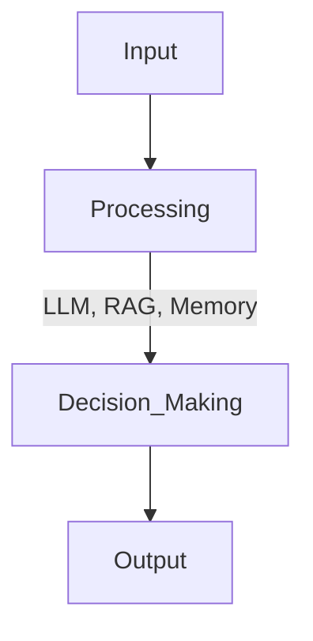

# Chapter 3: Building a Single-Agent System

## 3.1 What is a Single-Agent System?
A single-agent system is an AI-powered entity designed to operate independently, making decisions based on input data, context, and learned experiences. Unlike multi-agent systems, a single-agent system works autonomously without coordinating with other agents.

### Applications
Single-agent systems are widely used in various domains:
- **AI Chatbots**: Virtual assistants automate customer interactions, providing instant responses to queries, improving customer satisfaction, and reducing human workload.
- **Recommendation Systems**: Personalized recommendations enhance user experience on streaming platforms and e-commerce by suggesting relevant content or products.
- **Autonomous Task Execution**: Virtual assistants automate repetitive tasks like scheduling meetings, managing calendars, and summarizing documents.

## 3.2 Anatomy of an AI Agent
A single-agent AI system typically consists of the following components:
- **Input Handling**: Accepts user queries, sensor data, or API calls.
- **Processing Unit**: Uses models like GPT-4, Claude, or Gemini to process input and generate responses.
- **Memory & Context Awareness**: Maintains conversation history and contextual understanding.
- **Output Handling**: Returns responses through text, voice, or structured data formats.



## 3.3 Implementing a Basic Single-Agent System
Let’s build stateful AI agents using OpenAI’s Agents SDK, Gemini API, and Claude’s system message approach.

### 3.3.1 Stateful AI Agent using OpenAI 
**Python**
```python
from openai import OpenAI

client = OpenAI(api_key="YOUR_API_KEY")

class ResearchAssistantAgent:
    def __init__(self):
        self.memory = [
            {"role": "system", "content": "You are a helpful research assistant who provides concise and relevant answers."}
        ]

    def interact(self, user_input):
        self.memory.append({"role": "user", "content": user_input})
        response = client.chat.completions.create(
            model="gpt-4-turbo",
            messages=self.memory
        )
        reply = response.choices[0].message.content
        self.memory.append({"role": "assistant", "content": reply})
        return reply

agent = ResearchAssistantAgent()
print(agent.interact("What are large language models?"))
print(agent.interact("Give me an example of how they're used."))
```

**JavaScript**
```javascript
import { OpenAI } from "openai";

const openai = new OpenAI({ apiKey: 'OPENAI_API_KEY' });

class ResearchAssistantAgent {
  constructor() {
    this.memory = [
      { role: "system", content: "You are a helpful research assistant who provides concise and relevant answers." }
    ];
  }

  async interact(userInput) {
    this.memory.push({ role: "user", content: userInput });

    const response = await openai.chat.completions.create({
      model: "gpt-4o-mini",
      messages: this.memory,
    });

    const reply = response.choices[0].message.content;
    this.memory.push({ role: "assistant", content: reply });

    return reply;
  }
}

const agent = new ResearchAssistantAgent();

(async () => {
  console.log(await agent.interact("What are large language models?"));
  console.log(await agent.interact("Give me an example of how they're used."));
})();
```

### 3.3.2 Stateful AI Agent using Gemini API 
**Python**
```python
import google.generativeai as genai

genai.configure(api_key="YOUR_GEMINI_API_KEY")

class GeminiResearchAgent:
    def __init__(self):
        self.model = genai.GenerativeModel("gemini-pro")
        self.chat = self.model.start_chat(history=[
            {"role": "system", "parts": ["You are a helpful research assistant who provides concise and clear answers."]}
        ])

    def interact(self, user_input):
        response = self.chat.send_message(user_input)
        return response.text

agent = GeminiResearchAgent()
print(agent.interact("Explain generative AI."))
print(agent.interact("What are some common use cases?"))
```

**JavaScript**
```javascript
import OpenAI from "openai"; // for Gemini's OpenAI API compatibility

const openai = new OpenAI({
    apiKey: 'GEMINI_API_KEY',
    baseURL: "https://generativelanguage.googleapis.com/v1beta/openai/"
});

class GeminiResearchAgent {
  constructor(model = "gemini-2.0-flash") {
    this.model = model;
    this.messages = [
      {
        role: "system",
        content: "You are a helpful research assistant who provides concise and clear answers.",
      },
    ];
  }

  async interact(userInput) {
    this.messages.push({ role: "user", content: userInput });

    const response = await openai.chat.completions.create({
      model: this.model,
      messages: this.messages,
    });

    const message = response.choices[0].message.content;
    this.messages.push({ role: "assistant", content: message });
    return message;
  }
}

const run = async () => {
  const agent = new GeminiResearchAgent();
  console.log(await agent.interact("Explain generative AI."));
  console.log(await agent.interact("What are some common use cases?"));
};

run();
```

## 3.4 Enhancing Agents with Short-Term and Persistent Memory

In simple agents, memory is often limited to short-term context: the agent remembers only what has been said in the current session. However, real-world agents need **persistent memory** — the ability to remember facts, interactions, or references across sessions.

This is where frameworks like **LangChain** help: they provide structured memory management and integration with vector databases (also called vector stores) like FAISS, Weaviate, or Pinecone, which enable semantic search by embedding documents into a high-dimensional space.

### Types of Memory in AI Agents
| **Type**         | **Scope**                 | **Example Use**                             |
|------------------|---------------------------|----------------------------------------------|
| Short-Term       | Session-level (RAM)       | Holding dialogue turns in a chat             |
| Long-Term        | Cross-session (DB)        | Remembering user preferences or past queries |
| Retrieval Memory | Embedded semantic search  | Q&A over large documents                     |

### Example: Short-Term Conversational Memory with LangChain

**Python**
```python
from langchain.chat_models import ChatOpenAI
from langchain.memory import ConversationBufferMemory
from langchain.chains import ConversationChain

llm = ChatOpenAI(model_name="gpt-4", temperature=0)

memory = ConversationBufferMemory()
agent = ConversationChain(llm=llm, memory=memory)

print(agent.run("Hi, I'm working on an AI project."))
print(agent.run("Can you remind me what I just said?"))
```

**JavaScript**
```javascript
import { ChatOpenAI } from "@langchain/openai";
import { ConversationChain } from "langchain/chains";
import { BufferMemory } from "langchain/memory";

const model = new ChatOpenAI({ modelName: "gpt-4o-mini", openAIApiKey: 'OPENAI_API_KEY' });
const memory = new BufferMemory();
const conversation = new ConversationChain({ llm: model, memory });

async function chat() {
    const response1 = await conversation.call({ input: "What is the capital of France?" });
    console.log(response1.response);

    const followUpResponse = await conversation.call({ input: "And what is its population?" });
    console.log(followUpResponse.response);
}

chat();
```

## 3.5 Persistent Q&A Agent with Vector Memory (LangChain + FAISS)

Let’s create a **Q&A agent** that uses **retrieval-augmented generation (RAG)** a technique where the agent first retrieves relevant documents from a knowledge base and then uses a language model to generate informed responses to persist and recall factual knowledge, even when the original chat history isn’t retained.

### Step 1: Prepare Knowledge Base
```python
from langchain.vectorstores import FAISS
from langchain.embeddings import OpenAIEmbeddings
from langchain.document_loaders import TextLoader
from langchain.text_splitter import CharacterTextSplitter

loader = TextLoader("data/ai_fundamentals.txt")
docs = loader.load()
splitter = CharacterTextSplitter(chunk_size=500, chunk_overlap=50)
documents = splitter.split_documents(docs)

embeddings = OpenAIEmbeddings()
vectorstore = FAISS.from_documents(documents, embeddings)
```

### Step 2: Create a RAG-Enabled QA Agent
```python
from langchain.chains import RetrievalQA
from langchain.chat_models import ChatOpenAI

qa_chain = RetrievalQA.from_chain_type(
    llm=ChatOpenAI(model_name="gpt-4"),
    retriever=vectorstore.as_retriever()
)

print(qa_chain.run("What is reinforcement learning?"))
print(qa_chain.run("List applications of generative AI."))
```

## 3.6 Best Practices for Single-Agent Systems
- **Choose the Right Model**: Use GPT-4-turbo for reasoning, Claude for structured responses, or Gemini for rapid content generation.
- **Efficient Memory Handling**: Store relevant interactions to maintain context without unnecessary data overload.
- **API Flexibility**: Design your agent to support multiple APIs for robustness and flexibility.
- **Optimize Performance and Cost**: Employ caching, batching, and intelligent response filtering to manage API usage effectively.

---

## **Conclusion**

This chapter covered building a single-agent AI system, beginning with simple implementations using OpenAI Agents SDK, Gemini, and Claude. We then introduced advanced concepts like memory and persistence, demonstrated practical examples, and outlined best practices for developing robust single-agent applications. The next chapter explores multi-agent systems, extending these concepts further.


---

[Previous: Chapter 2](https://github.com/FrugalX/ai_agents_ebook_draft/blob/main/Chapter%202%20Generative%20AI%20APIs%20Gett.md) | [Next: Chapter 4](https://github.com/FrugalX/ai_agents_ebook_draft/blob/main/Chapter%204%20Multi-Agent%20Systems%20Col.md)

