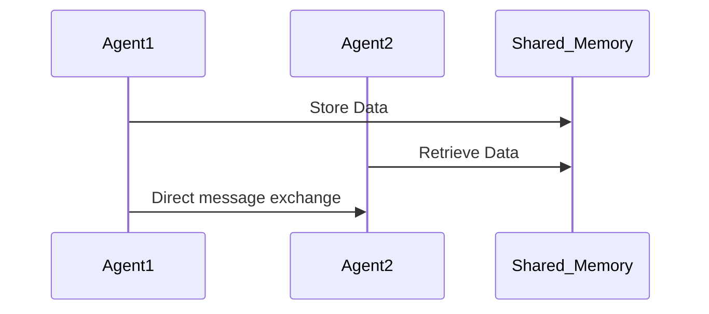

# Chapter 4: Multi-Agent Systems: Collaboration Among Agents

## **4.1 What are Multi-Agent Systems?**

Multi-agent systems (MAS) involve multiple AI agents working together to solve complex problems or achieve shared goals. These systems can:

- Collaborate to combine knowledge and capabilities.
- Operate independently while sharing information when needed.
- Model real-world systems like social networks, markets, and collaborative workflows.

### **Key Features of Multi-Agent Systems:**

1. **Autonomy**: Agents operate without continuous human supervision.
2. **Communication**: Agents share data or coordinate actions through messaging protocols.
3. **Collaboration**: Agents work together to achieve tasks beyond the scope of individual agents.
4. **Coordination**: Agents can delegate tasks and synchronize their workflows.
5. **Adaptability**: Agents dynamically adjust based on changing environments or objectives.

Additionally, modern frameworks like **Microsoft AutoGen**, **LangChain Agent Executors**, and **OpenAI's Agents SDK** have emerged to simplify the development and deployment of multi-agent systems. These frameworks provide structured mechanisms for enabling agent collaboration, tool use, and reasoning capabilities.

Each framework has distinct strengths:
- **LangChain**: Offers flexibility in agent integration with external tools and APIs.
- **AutoGen**: Provides structured workflows, making it ideal for multi-agent collaboration and orchestration.
- **OpenAI Agents SDK**: Focuses on ease of use with integrated OpenAI models and built-in collaboration tools.

### **The Role of Model Context Protocol (MCP) in Multi-Agent Systems**

As AI agents become more autonomous, they require a way to **share and persist context across interactions**. The **Model Context Protocol (MCP)** is an emerging standard designed to enhance AI agent collaboration by:
- **Maintaining a shared knowledge base** across multiple agents.
- **Enabling persistent memory** to ensure AI agents recall prior interactions.
- **Facilitating context-aware decision-making** across distributed AI systems.

MCP improves coordination in **multi-agent environments**, ensuring agents have access to a consistent, up-to-date understanding of tasks, users, and objectives.

---

## **4.2 Communication Between Agents**

Communication is vital in MAS for coordination and task-sharing. Common techniques include:

1. **Message Passing**: Agents send structured messages (e.g., JSON objects) to share data or request actions.
2. **Shared Environment**: Agents interact indirectly by modifying a shared digital space (e.g., a database or vector store).
3. **Protocols**: Define the rules for interaction, such as:
   - **Request-Response**: An agent requests information or action, and another agent responds.
   - **Broadcasting**: An agent shares information with all other agents.
   - **Function Calling**: Agents invoke external tools or APIs to extend their capabilities.



### **Leveraging MCP for Improved Communication**
MCP provides a standardized approach to **context management** in multi-agent communication by:
- **Reducing redundant information exchange** through persistent memory.
- **Allowing context-aware conversations** between agents, improving efficiency.
- **Enhancing inter-agent collaboration** by structuring historical interactions logically.

**Frameworks like AutoGen, OpenAI's Agents SDK, and LangChain integrate well with MCP**, allowing agents to engage in structured dialogues and task delegation while maintaining memory continuity.

---

## **4.3 Example: A Chat Simulation Between Two Agents**

### **JavaScript Example: Conversational Role Play**

Simulating a conversation between two agents using Node.js and LangChain:

```javascript
import { ChatOpenAI } from "langchain/chat_models";
import { AgentExecutor, initializeAgentExecutorWithOptions } from "langchain/agents";
import { OpenAI } from "langchain/llms";

const model = new ChatOpenAI({ modelName: "gpt-4", temperature: 0.7 });
const tools = []; // Define tools if needed

async function simulateConversation() {
  const executor = await initializeAgentExecutorWithOptions(tools, model, {
    agentType: "chat-conversational",
    verbose: true,
  });
  
  const response = await executor.call({ input: "Agent A: How can I help you today?" });
  console.log(response.output);
}

simulateConversation();
```

### **Python Example: Collaborative Idea Generation with AutoGen**

```python
from autogen import AssistantAgent, UserProxyAgent

def collaborative_idea_generation():
    assistant = AssistantAgent(name="AgentA")
    user = UserProxyAgent(name="AgentB", human_input_mode="NEVER")
    
    user.initiate_chat(
        assistant,
        message="Let's brainstorm ideas for a new AI-powered application."
    )

collaborative_idea_generation()
```

### **Python Example: Using OpenAI's Agents SDK for Coordination**

```python
from openai import OpenAI

client = OpenAI()

response = client.beta.agents.create(
    name="ResearchAgent",
    instructions="Assist with research by summarizing the latest AI developments."
)

print("Agent Created:", response)
```

These examples showcase how AutoGen, OpenAI's Agents SDK, and LangChain facilitate structured agent dialogues and interactivity.

---

## **4.4 When to Use Multi-Agent Systems?**

MAS is ideal for scenarios where:

- **Scalability is needed**: Multiple agents divide tasks efficiently.
- **Distributed Systems**: Tasks are performed in different locations or contexts.
- **Complex Problem-Solving**: Collaboration enhances problem-solving abilities.
- **Simulations**: Modeling interactions in a system (e.g., traffic systems, markets).

### **Examples in the Real World:**

1. **E-commerce**: Recommendation systems interacting with inventory management agents.
2. **Gaming**: NPCs collaborating to create realistic environments.
3. **Healthcare**: Agents for diagnosis, patient tracking, and logistics.
4. **Software Engineering**: AI agents collaborating on debugging, documentation, and deployment tasks.
5. **Customer Support**: Multi-agent chatbots handling complex inquiries by breaking them down into specialized tasks.
6. **Scientific Research**: AI-powered research assistants coordinating literature reviews and experiment planning.

---

## **4.5 Performance Considerations When Choosing Frameworks**

When selecting an agent framework, consider the following performance characteristics:

- **Scalability**: How well the framework handles an increasing number of agents in parallel.
- **Latency**: Response time and processing efficiency, especially for real-time applications.
- **Complexity & Maintainability**: Trade-offs between framework flexibility and ease of implementation.
- **Cost Effectiveness**: API usage rates, compute resource demands, and infrastructure expenses.
- **Reliability & Error Handling**: How well the framework manages unexpected failures and ensures consistent execution.

### **How MCP Improves Performance in Multi-Agent Systems**
- **Reduces computational overhead** by allowing agents to store and retrieve shared context efficiently.
- **Improves cross-agent collaboration** by ensuring **context persistence** in distributed AI ecosystems.
- **Enhances scalability** by minimizing unnecessary redundant data exchange.

By integrating modern frameworks like **AutoGen, OpenAI's Agents SDK, and LangChain**, and leveraging **MCP for efficient context sharing**, developers can build robust, scalable, and intelligent agent-based systems with structured interactions and enhanced functionality.


---

[Previous: Chapter 3](https://github.com/FrugalX/ai_agents_ebook_draft/blob/main/Chapter%203%20Building%20a%20Single-Agent.md) | [Next: Chapter 5](https://github.com/FrugalX/ai_agents_ebook_draft/blob/main/Chapter%205%20Autonomous%20and%20Self-Orc.md)


