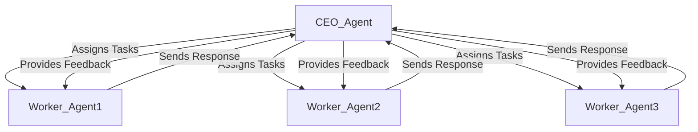

# Chapter 5: Autonomous and Self-Orchestrated Multi-Agent Systems

## 5.1 What is Autonomy in AI Agents?

Autonomy in AI agents refers to their ability to operate independently, make decisions, and adapt to new information without direct human intervention. Autonomous agents can range from simple rule-based systems to complex, self-improving AI models capable of reasoning and long-term planning.

### Key Characteristics of Autonomous Agents:
- **Self-Guided Decision-Making:** Agents analyze data and decide on actions without explicit instructions.
- **Adaptive Learning:** Ability to refine strategies over time based on outcomes and feedback.
- **Minimal Human Supervision:** Designed to function effectively with limited or no human intervention.
- **Hierarchical Structures:** In complex systems, agents can be organized hierarchically, with higher-level agents (e.g., manager agents) overseeing lower-level agents (e.g., worker agents).

## 5.2 Orchestration vs. Autonomy

### Orchestration
In an orchestrated system, a central controller assigns tasks to agents and coordinates their activities. While efficient, orchestration can become a bottleneck and limit scalability.

**Example:** A project manager assigning tasks to team members and monitoring their progress.

### Autonomy
Autonomous systems decentralize decision-making, allowing individual agents to act independently. These systems can:
- Handle complexity without overloading a central controller.
- Increase resilience by eliminating single points of failure.

### Hierarchical Agent Systems
A hierarchical agent system is a structured approach where agents are divided into different roles based on levels of responsibility:
- **High-Level Agents (Strategic/CEO Agents):** Responsible for strategic decision-making and delegating tasks.
- **Mid-Level Agents (Tactical/Coordinator Agents):** Monitor task progress and reassign resources dynamically.
- **Low-Level Agents (Operational/Worker Agents):** Execute specific tasks assigned by higher-level agents.

This structure improves **scalability, efficiency, and fault tolerance** in multi-agent environments.



### Comparison Table:

| Feature         | Orchestration | Autonomy |
|---------------|--------------|---------|
| Control Mechanism | Centralized | Decentralized |
| Scalability | Limited | High |
| Resilience | Lower | Higher |
| Complexity | Simplified for agents | Handled by individual agents |

## 5.3 Examples Using Multiple Agents
The examples below include a central decision-making agent (the CEO) that delegates tasks to specialized agents, incorporates agent-to-agent communication, and establishes a feedback loop for dynamic task management.

The orchestrator (Task Manager) assigns tasks to specialized agents and handles the flow of information between agents and the CEO. The CEO Agent (Strategic Decision-Maker) analyzes the agents' outputs and makes strategic decisions, provides feedback, and directs further tasks if needed.

These examples combine orchestration and autonomy.

### 5.3.1 JavaScript: Event Planner with Autonomous Sub-Agents
This example demonstrates a hierarchical agent system where a **CEO-Agent** delegates tasks to specialized **Worker-Agents**.

```javascript
import { OpenAI } from "openai";

const openai = new OpenAI({ apiKey: 'OPENAI_API_KEY' });

// Orchestrator: Assigns tasks to different agents
async function orchestrator() {
    const tasks = {
        "Venue Agent": "Find a suitable venue for 100 people.",
        "Catering Agent": "Plan a menu for lunch and dinner.",
        "Schedule Agent": "Draft an agenda for a 1-day conference."
    };

    const agentResponses = {};

    for (const [agent, task] of Object.entries(tasks)) {
        const response = await openai.chat.completions.create({
            model: "gpt-4o-mini",
            messages: [
                { role: "system", content: `You are ${agent}, responsible for: ${task}` },
                { role: "user", content: task }
            ]
        });
        agentResponses[agent] = response.choices[0].message.content;
        console.log(`${agent} Response: ${agentResponses[agent]}`);
    }

    // Pass responses to the CEO for strategic decisions
    ceoAgent(agentResponses);
}

// CEO Agent: Analyzes responses and provides feedback
async function ceoAgent(agentResponses) {
    console.log("\n--- CEO Analysis ---");

    for (const [agent, response] of Object.entries(agentResponses)) {
        let feedback = null;

        if (response.toLowerCase().includes("venue")) {
            feedback = "Please include details on the venue's accessibility and amenities.";
        } else if (response.toLowerCase().includes("menu")) {
            feedback = "Suggest options for dietary restrictions, including vegetarian and gluten-free.";
        } else if (response.toLowerCase().includes("agenda")) {
            feedback = "Add time slots for networking breaks and keynote speeches.";
        }

        if (feedback) {
            const feedbackResponse = await openai.chat.completions.create({
                model: "gpt-4o-mini",
                messages: [
                    { role: "system", content: `You are ${agent}, responding to the CEO's feedback.` },
                    { role: "user", content: feedback }
                ]
            });
            console.log(`Feedback for ${agent}: ${feedbackResponse.choices[0].message.content}`);
        } else {
            console.log(`No specific feedback needed for ${agent}.`);
        }
    }
}

// Run the orchestrator
orchestrator();
```

### 5.3.2 Python: Research Assistants Coordinating Tasks
This Python example showcases hierarchical autonomy in a research setting.

```python
from openai import OpenAI

# Initialize OpenAI with the API key
client = OpenAI(
  api_key='OPENAI_API_KEY',  
)

# Orchestrator: Manages task distribution and agent communication
def orchestrator():
    tasks = {
        'Agent A': 'Research current AI trends in healthcare.',
        'Agent B': 'Summarize recent advancements in natural language processing.',
        'Agent C': 'Find examples of AI-powered robotics in manufacturing.'
    }

    # Assign tasks to agents
    agent_responses = {}
    for agent_name, task in tasks.items():
        response = client.chat.completions.create(
            model="gpt-4o-mini",
            messages=[
                {"role": "system", "content": f"You are {agent_name}, an AI assistant specializing in {task}."},
                {"role": "user", "content": task}
            ]
        )
        agent_responses[agent_name] = response.choices[0].message.content
        print(f"{agent_name} Response: {agent_responses[agent_name]}")

    # Pass responses to the CEO for strategic analysis
    ceo_agent(agent_responses)

# CEO Agent: Makes strategic decisions based on agent responses
def ceo_agent(agent_responses):
    print("\n--- CEO Analysis ---")

    # Example strategic decision-making
    for agent, response in agent_responses.items():
        feedback = None  # Initialize feedback to handle cases where no condition matches

        if "AI trends" in response:
            print(f"{agent}: Requires deeper analysis on healthcare applications.")
            feedback = "Expand on how AI is being applied specifically in healthcare diagnostics."
        elif "robotics" in response:
            print(f"{agent}: Needs more detail on robotics innovations.")
            feedback = "Include specific case studies of recent robotics implementations."

        # Providing feedback
        if feedback:
            feedback_response = client.chat.completions.create(
                model="gpt-4o-mini",
                messages=[
                    {"role": "system", "content": f"You are {agent}, an AI assistant specializing in the same field as before."},
                    {"role": "user", "content": feedback}
                ]
            )
            print(f"Feedback for {agent}: {feedback_response.choices[0].message.content}")
        else:
            print(f"No specific feedback needed for {agent}.")

# Run the orchestrator
orchestrator()
```

## 5.4 Challenges in Building Self-Orchestrated Systems
- **Maintaining Balance Between Autonomy and Control:** Overly independent agents may diverge from intended goals.
- **Ensuring Robust Inter-Agent Communication:** Breakdown in communication can lead to inefficiencies or failures.
- **Scalability of Hierarchical Agents:** Designing multi-tiered agent hierarchies requires careful planning.
- **Error Handling & Recovery:** Ensuring agents recover from failures without human intervention.

## 5.5 Performance Considerations in Self-Orchestrated Systems
As AI systems move towards **self-orchestrating multi-agent architectures**, key challenges emerge in balancing **autonomy with efficiency**.

### **Key Factors for Performance Optimization:**
- **Scalability:** How efficiently the system handles multiple agents executing tasks in parallel.
- **Latency:** Optimizing real-time processing speed in distributed environments.
- **Resource Efficiency:** Managing API calls and computational costs in agent interactions.
- **Fault Tolerance:** Ensuring individual agent failures do not disrupt the entire system.

### **Comparison of Frameworks for Self-Orchestrating AI Agents:**

| Framework         | Scalability | Complexity | Cost Efficiency | Fault Tolerance |
|-----------------|------------|------------|----------------|---------------|
| OpenAI Agents SDK | High       | Low        | Moderate       | High          |
| AutoGen         | Medium     | High       | High           | Medium        |
| LangChain Agents | High       | Medium     | Moderate       | High          |
| Custom Mistral Setup | High  | High       | Low            | Medium        |

### **Best Practices:**
- **Agent Collaboration Strategies:** Assign well-defined roles to agents (CEO-Agent, Worker-Agents) for better task execution.
- **Parallel Task Execution:** Optimize processing efficiency by designing agents to work concurrently rather than sequentially.
- **Smart Error Handling:** Implement **fallback mechanisms** to manage failures and reduce disruptions in autonomous workflows.

---

Autonomous multi-agent systems represent a significant leap in AI, enabling solutions to complex, dynamic, and large-scale problems. By addressing the challenges and leveraging best practices, developers can unlock their full potential.

---

[Previous: Chapter 4](https://github.com/FrugalX/ai_agents_ebook_draft/blob/main/Chapter%204%20Multi-Agent%20Systems%20Col.md) | [Next: Chapter 6](https://github.com/FrugalX/ai_agents_ebook_draft/blob/main/Chapter%206%20Key%20Concepts%20in%20Generat.md)

