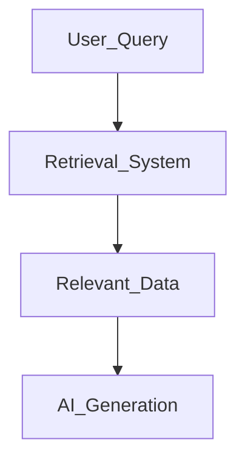
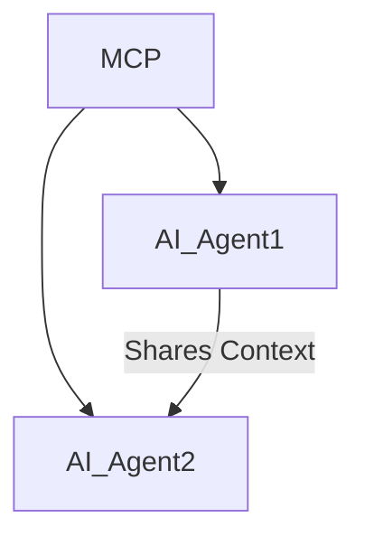

# Chapter 6: Key Concepts in Generative AI Agents

## **6.1 Prompt Engineering for Agents**
Prompt engineering involves crafting effective inputs to guide AI models in generating desired outputs. This is critical for ensuring that agents:

- Respond accurately and contextually.
- Generate outputs aligned with user expectations.
- Handle complex queries with minimal ambiguity.

### **Best Practices in Prompt Engineering:**
1. **Clarity**: Use simple, direct language.
   - Example: "Write a 100-word story about space exploration."
2. **Specificity**: Provide detailed instructions.
   - Example: "List three reasons why renewable energy is important."
3. **Contextualization**: Include background information for nuanced responses.
   - Example: "As a travel agent, recommend a 5-day itinerary in Paris."
4. **Iterative Refinement**: Test and tweak prompts for optimal results.

### **Example: Crafting Prompts for AI Agents**
- **General Query**: "Explain climate change."
- **Refined Query**: "Explain climate change in simple terms for a 10-year-old."

Additionally, **multi-step prompting** and **function calling** within AI models allow agents to break down complex queries into structured responses. **OpenAI’s function-calling mechanisms** and **Gemini’s API reasoning capabilities** further enhance prompt effectiveness.

---

## **6.2 Memory and Context in Agents**
AI agents use memory and context to maintain coherence across interactions. These features are particularly important in:

- **Conversations**: Retaining previous messages to provide relevant responses.
- **Task Execution**: Keeping track of progress in multi-step tasks.
- **Personalization**: Adapting to user preferences over time.

### **Types of Memory in AI Agents:**
1. **Short-Term Memory**:
   - Stores recent inputs during a session.
   - Example: A chatbot remembering the user's name during a conversation.
2. **Long-Term Memory**:
   - Retains information across sessions for continuity.
   - Example: A virtual assistant recalling a user’s favorite music genre.
   - Implemented via solutions like **OpenAI Agents SDK Memory**, **LangChain Memory**, and **Weaviate vector databases**.

   ```mermaid
   graph TD
    User_Query --> Short_Term_Memory
    Short_Term_Memory --> Processing
    Processing -->|Decision| Long_Term_Memory
    Long_Term_Memory --> Future_Interactions
   ```

### **Retrieval-Augmented Generation (RAG):**
- Enhances AI responses by retrieving relevant data from external knowledge sources.
- Improves accuracy and reduces hallucinations.
- Example: A research assistant using **RAG** to pull updated scientific papers before answering a query.
- **OpenAI’s Retrieval API**, **LlamaIndex**, and **LangChain RAG** are widely used for structured document retrieval.
- **Vector databases** like **Weaviate and Pinecone** enable scalable, high-speed access to stored knowledge.



### **Implementing Context Awareness:**
- Maintain a history of interactions and integrate it into agent responses.
- Use structured retrieval techniques to reference prior knowledge.
- **OpenAI Agents SDK now supports memory persistence**, allowing agents to retain knowledge across multiple interactions, ensuring more relevant and personalized responses.

### **Integrating Model Context Protocol (MCP) for AI Memory**

The **Model Context Protocol (MCP)** is an emerging framework designed to improve **context sharing and memory retention** across AI agents. By integrating MCP, AI agents can:
- **Maintain a unified knowledge base**, ensuring all agents have access to shared memory.
- **Enable seamless multi-session interactions**, reducing the need for redundant queries.
- **Enhance personalization**, by allowing AI systems to store and retrieve user-specific information across platforms.



MCP provides **structured memory management**, ensuring that context is **securely stored, retrieved efficiently, and shared responsibly among agents**, especially in multi-agent environments.

---

## **6.3 Managing State and Conversations**
State management ensures that AI agents handle multi-turn interactions effectively. This involves:

1. **Tracking Conversation Flow:**
   - Ensuring continuity and relevance in responses.
2. **Context Switching:**
   - Allowing agents to pivot smoothly between topics.
3. **Error Recovery:**
   - Detecting and correcting misinterpretations or inconsistencies.

### **Techniques for State Management:**
1. **Finite State Machines (FSMs):**
   - Define clear states and transitions for the agent.
   - Example: States for a travel agent: "Greeting," "Flight Booking," "Hotel Booking."
2. **Session Tokens:**
   - Use unique tokens to link user interactions within a session.
3. **Memory Integration:**
   - **OpenAI Agents SDK Memory**, **LangChain Memory**, and **vector databases** provide structured state retention.
   - Best practices include **session-based memory management** and **hybrid approaches combining local and cloud memory** for optimized performance.

### **MCP for Context Persistence in AI Agents**
MCP provides a standardized **protocol for managing state** in AI-driven workflows. It allows:
- **Cross-agent coordination**, where multiple AI agents **share and update contextual knowledge**.
- **Session continuity**, ensuring that AI assistants retain memory across multiple user interactions.
- **Improved response consistency**, reducing redundancy and improving contextual awareness in long conversations.

---

## **6.4 Handling Errors and Failures in AI Systems**
Errors are inevitable in AI systems, but robust error-handling strategies can minimize their impact.

### **Common Types of Errors:**
1. **Input Errors:**
   - User inputs are ambiguous, incomplete, or nonsensical.
   - Example: "Tell me about 'xvvz'" (nonsensical query).
2. **Model Errors:**
   - The model generates irrelevant or incorrect outputs.
   - Example: Recommending books when asked about movies.
3. **System Errors:**
   - Failures in the underlying infrastructure or APIs.

### **Strategies for Error Handling:**
1. **Fallback Responses:**
   - Provide generic responses when specific answers aren’t available.
   - Example: "I’m sorry, I don’t have information on that."
2. **Validation and Preprocessing:**
   - Check user inputs for errors before processing.
   - Example: Ensuring date formats are correct before booking.
3. **Retry Mechanisms:**
   - Attempt the operation again if it fails initially.
   - Example: Retrying API calls after network interruptions.
4. **Logging and Monitoring:**
   - Track errors to identify and resolve recurring issues.
   - **OpenAI's event-driven error handling**, **Sentry**, and **Datadog** provide real-time monitoring.
   - **Automated alerting** enables AI agents to self-correct without human intervention.

By mastering these key concepts, developers can build more **robust, scalable, and intelligent** generative AI agents that **adapt dynamically to new challenges** while maintaining accuracy, efficiency, and resilience.


---

[Previous: Chapter 5](https://github.com/FrugalX/ai_agents_ebook_draft/blob/main/Chapter%205%20Autonomous%20and%20Self-Orc.md) | [Next: Chapter 7](https://github.com/FrugalX/ai_agents_ebook_draft/blob/main/Chapter%207%20Practical%20Tutorials.md)

