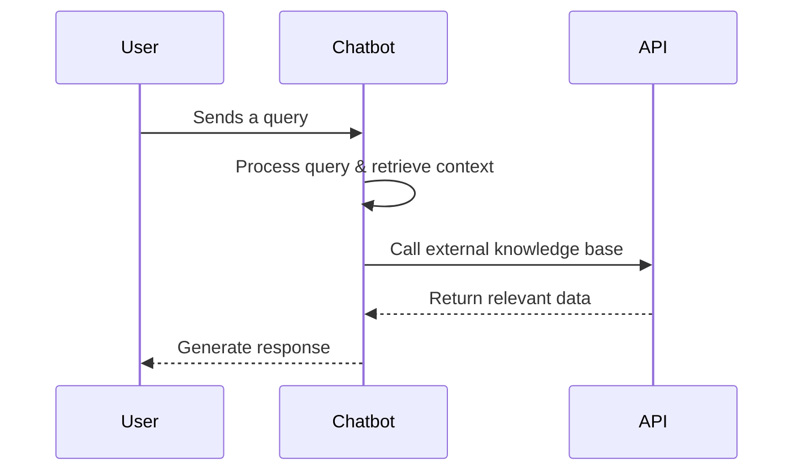
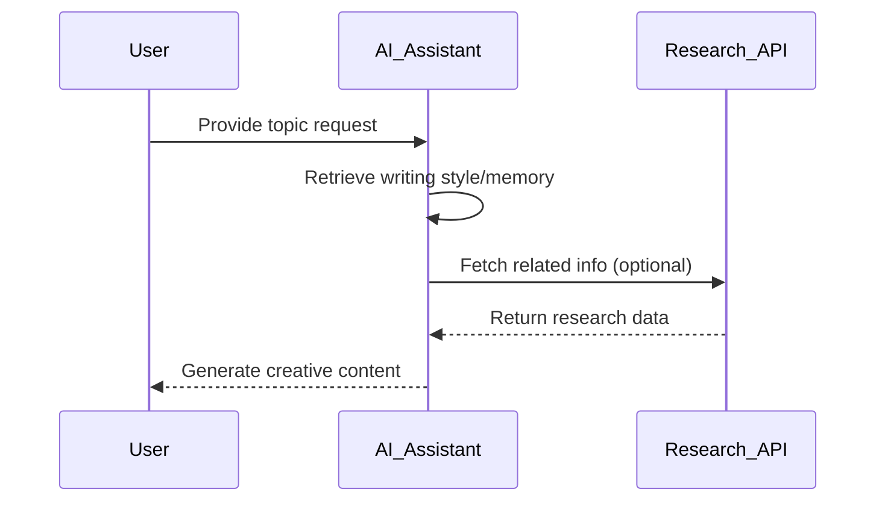
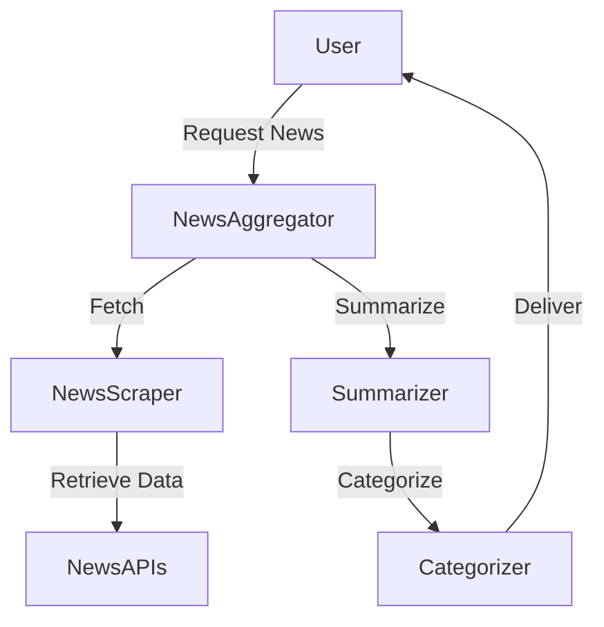
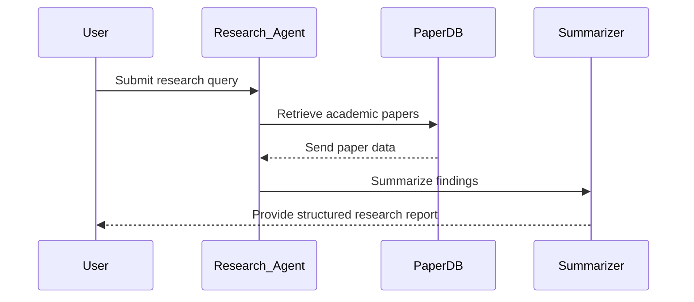
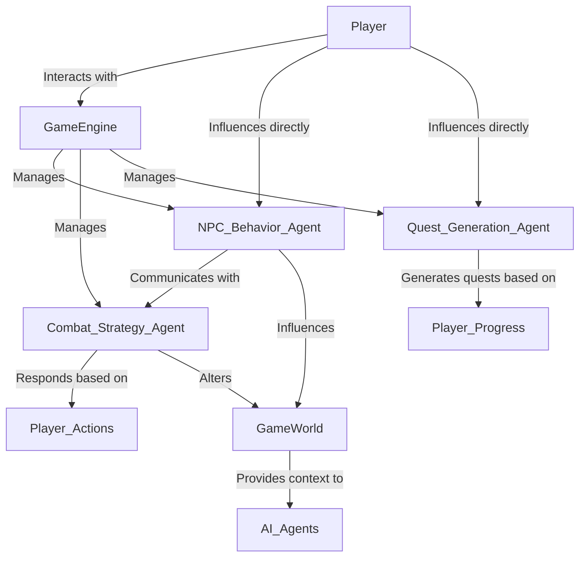

# Chapter 7: Practical Tutorials

## 7.1 Getting Started with Generative AI Agents

This chapter provides hands-on tutorials for building AI agents using various APIs, ensuring a balanced representation of OpenAI, Google Gemini or Anthropic Claude. We will cover step-by-step implementations for building single-agent and multi-agent systems.

## 7.2 Setting Up Your Environment

Before we dive into the tutorials, install the necessary dependencies:

```bash
pip install openai anthropic google-generativeai langchain
```

### API Keys
Obtain API keys from OpenAI (for the Agents SDK & Responses API), Anthropic (Claude API), and Google (Gemini API) for open-source LLMs.

## 7.3  Building An AI Chatbot for Customer Support

### **Learning Outcome**
By the end of this tutorial, you will have a fully functional AI chatbot capable of handling customer queries efficiently. The chatbot will be implemented using **OpenAI’s Agents SDK**, **Gemini API**, and **Claude API**, with both **Python and JavaScript examples**.



### **Step 1: Setting Up the AI Chatbot**
- Choose your AI provider (OpenAI, Gemini, or Claude).
- Define chatbot instructions and expected behavior.

### **Python: AI Chatbot with OpenAI Agents SDK**
```python
from openai import OpenAI

client = OpenAI(api_key="YOUR_API_KEY")

def chat_with_ai(message):
    response = client.beta.threads.create_and_run(
        assistant_id="your_assistant_id",
        thread={"messages": [{"role": "user", "content": message}]}
    )
    return response

print(chat_with_ai("What are your store hours?"))
```

### **JavaScript: AI Chatbot with OpenAI Agents SDK**
```javascript
import { OpenAI } from "openai";

const openai = new OpenAI({ apiKey: "YOUR_API_KEY" });

async function chatWithAI(message) {
    const response = await openai.beta.threads.createAndRun({
        assistant_id: "your_assistant_id",
        thread: { messages: [{ role: "user", content: message }] },
    });
    console.log(response);
}

chatWithAI("What are your store hours?");
```

### **Alternative: Using Google Gemini API for the Chatbot**
- Gemini API can be used for a more **multi-modal approach**, integrating text, images, and videos.

### **Alternative: Using Claude API for the Chatbot**
- Claude specializes in **structured conversations with high reliability**.

This chatbot can be integrated into web apps, mobile apps, or backend systems for automated customer support.

## 7.4 Developing a Creative Content Assistant ##

### **Learning Outcome**
By the end of this tutorial, you will develop an AI-powered content assistant capable of generating creative writing pieces like stories, blog posts, and social media captions.



### **Step 1: Setting Up the Content Assistant**
- Choose your AI provider (OpenAI, Gemini, or Claude).
- Define creative writing instructions and expected outputs.

### **Python: AI-Powered Creative Writer (OpenAI’s GPT-4 Turbo)**
```python
import openai

def generate_content(prompt):
    response = openai.ChatCompletion.create(
        model="gpt-4-turbo",
        messages=[{"role": "user", "content": prompt}]
    )
    return response["choices"][0]["message"]["content"]

print(generate_content("Write a short story about an astronaut on Mars."))
```

### **JavaScript: AI-Powered Creative Writer (OpenAI’s GPT-4 Turbo)**
```javascript
import { OpenAI } from "openai";

const openai = new OpenAI({ apiKey: "YOUR_API_KEY" });

async function generateContent(prompt) {
    const response = await openai.chat.completions.create({
        model: "gpt-4-turbo",
        messages: [{ role: "user", content: prompt }]
    });
    console.log(response.choices[0].message.content);
}

generateContent("Write a short story about an astronaut on Mars.");
```

### **Alternative: Using Google Gemini API for Content Generation**
- Gemini API provides multi-modal creativity by integrating text, images, and video generation into content workflows.

### **Alternative: Using Claude API for Structured Content Writing**
- Claude excels in creating **coherent, structured, and well-formed content** across different domains.

This content assistant can be integrated into **blog platforms, social media management tools, or creative writing applications** to automate content production.

## 7.5 Creating a Multi-Agent News Aggregator

### **Learning Outcome**
By the end of this tutorial, you will build a **multi-agent system** that gathers, summarizes, and organizes news articles from different sources.



### **Step 1: Understanding Multi-Agent Collaboration**
- **Fetching Agent**: Retrieves news articles from APIs like NewsAPI.
- **Summarization Agent**: Condenses information for easier consumption.
- **Categorization Agent**: Sorts articles into relevant topics.

### **Python: Multi-Agent News Aggregator Using AutoGen**
```python
from autogen import UserProxyAgent, AssistantAgent

def news_aggregator():
    fetch_agent = AssistantAgent(name="NewsFetcher")
    summary_agent = AssistantAgent(name="Summarizer")
    user = UserProxyAgent(name="User", human_input_mode="NEVER")

    user.initiate_chat(
        fetch_agent, message="Retrieve top tech news articles."
    )
    user.initiate_chat(
        summary_agent, message="Summarize the retrieved articles."
    )

news_aggregator()
```

### **JavaScript: Multi-Agent News Aggregator Using LangChain**
```javascript
import { ChatOpenAI } from "langchain/chat_models";

const model = new ChatOpenAI({ modelName: "gpt-4", temperature: 0.7 });

async function fetchNews() {
    const response = await model.call("Retrieve top tech news articles.");
    console.log(response);
}
fetchNews();
```

### **Alternative Approaches**
- **Google Gemini API**: For **multi-modal news aggregation**, incorporating **text and images**.
- **Claude API**: Ideal for structured content summarization.

This news aggregator can be integrated into **news websites, RSS readers, or AI-driven research tools** for automated news curation.

## 7.6 Designing a Self-Orchestrated Research Tool

### **Learning Outcome**
By the end of this tutorial, you will have built a **self-orchestrating research agent** capable of fetching, analyzing, and summarizing research papers using AI.



### **Step 1: Understanding Multi-Agent Research Workflows**
A self-orchestrated research tool automates literature review, data analysis, and summarization.

- **Research Fetching Agent**: Retrieves relevant academic papers.
- **Summarization Agent**: Extracts key insights from long papers.
- **Trend Analysis Agent**: Identifies recurring themes and trends.

### **Python: Self-Orchestrating Research Assistant with AutoGen**
```python
from autogen import UserProxyAgent, AssistantAgent

def research_assistant():
    fetch_agent = AssistantAgent(name="PaperFetcher")
    summary_agent = AssistantAgent(name="Summarizer")
    analysis_agent = AssistantAgent(name="TrendAnalyzer")
    user = UserProxyAgent(name="User", human_input_mode="NEVER")

    user.initiate_chat(
        fetch_agent, message="Find recent research papers on deep learning."
    )
    user.initiate_chat(
        summary_agent, message="Summarize the main findings from the papers."
    )
    user.initiate_chat(
        analysis_agent, message="Analyze trends from the summarized research."
    )

research_assistant()
```

### **JavaScript: Research Assistant with LangChain**
```javascript
import { ChatOpenAI } from "langchain/chat_models";

const model = new ChatOpenAI({ modelName: "gpt-4", temperature: 0.7 });

async function researchAssistant() {
    const response = await model.call("Find recent research papers on deep learning.");
    console.log(response);
}
researchAssistant();
```

### **Alternative Approaches**
- **Google Gemini API**: Enables multi-modal research by incorporating **text, charts, and graphs**.
- **Claude API**: Best for **structured document summarization** and in-depth analysis.

This research tool can be integrated into **academic search engines, AI-driven research assistants, or corporate knowledge bases**.

## 7.7 Designing Dynamic Games with AI-Powered Agents

### **Learning Outcome**
By the end of this tutorial, you will learn to develop AI-powered game features (NPCs, quests, combat strategies).

### **Understanding AI Agents in Gaming**
AI agents in gaming are autonomous entities that make decisions, adapt to changing environments, and interact with players or other agents to create dynamic and immersive experiences. Unlike simple scripted behaviors, AI agents can learn, strategize, and respond in real-time.

**Key Types of AI Agents in Gaming**
- **NPC Behavior Agent**: Controls non-playable characters (NPCs) to create lifelike interactions.
- **Combat Strategy Agent**: Determines optimal attack/defense strategies during combat.
- **Environment Interaction Agent**: Adapts the game world dynamically based on AI decisions.
- **Dynamic Quest Generation Agent**: Creates unique quests based on player progression and in-game events.
- **AI-Powered Enemy Behavior Agent**: Simulates intelligent enemy behavior that adapts over time.
- **Storytelling and Memory Agent**: Enhances narrative depth by remembering past player actions.

The diagram below illustrates the dynamic interactions between the player, game engine, AI agents, and the game world. The player engages with the game engine, which manages various AI agents, including the NPC Behavior Agent, Combat Strategy Agent, and Quest Generation Agent. These agents operate autonomously but also communicate with each other—for example, the NPC Behavior Agent interacts with the Combat Strategy Agent to create cohesive gameplay experiences. Player actions directly influence AI agents, shaping NPC behaviors and quest outcomes, while the AI agents respond based on real-time game contexts. Additionally, the agents actively influence the game world, altering environments, strategies, and narratives based on decisions made during gameplay.



**Note:** The tutorials provided below focus on specific types of AI agents within this system, such as NPC behavior, combat strategies, and dynamic quest generation. They do not cover the full range of agents or the complete game architecture depicted in the diagram. This overview serves to illustrate how these agents fit into a broader, dynamic gaming environment.

### **7.7.1 AI-Powered NPC Behaviour**
**Python**
```python
from openai import OpenAI

client = OpenAI(api_key="YOUR_API_KEY")

def npc_behavior(npc_role):
    response = client.beta.threads.create_and_run(
        assistant_id="your_npc_id",
        thread={"messages": [{"role": "user", "content": f"What should {npc_role} do in battle?"}]}
    )
    return response

print(npc_behavior("Warrior"))
```

**JavaScript**
```javascript
import { OpenAI } from "openai";

const openai = new OpenAI({ apiKey: "YOUR_API_KEY" });

async function npcBehavior(npcRole) {
    const response = await openai.beta.threads.createAndRun({
        assistant_id: "your_npc_id",
        thread: { messages: [{ role: "user", content: `What should ${npcRole} do in battle?` }] },
    });
    console.log(response);
}

npcBehavior("Warrior");
```

### **7.7.2 Autonomous NPC with Basic Decision-Making**
**Python**
```python
from openai import OpenAI

# Initialize OpenAI with the API key
client = OpenAI(
  api_key='OPENAI_API_KEY',  
)

def npc_agent(state):
    try:
        response = client.chat.completions.create(
            model="gpt-4o-mini",
            messages=[
                {"role": "system", "content": "You are an NPC in a survival game with goals to stay alive and gather resources."},
                {"role": "user", "content": f"Current state: {state}. What should the NPC do next?"}
            ]
        )
        action = response.choices[0].message.content
        print("NPC Action:", action)
        return action
    except Exception as error:
        print("Error:", error)

# Example scenario
npc_agent("Low health, near a water source, with no food")
```

**JavaScript**
```javascript
import { OpenAI } from "openai";

const openai = new OpenAI({ apiKey: "OPENAI_API_KEY" });

async function npcAgent(state) {
    const response = await openai.chat.completions.create({
        model: "gpt-4o-mini",
        messages: [
            { role: "system", content: "You are an NPC in a survival game with goals to stay alive and gather resources." },
            { role: "user", content: `Current state: ${state}. What should the NPC do next?` }
        ]
    });

    const action = response.choices[0].message.content;
    console.log("NPC Action:", action);
    return action;
}

// Example scenario
npcAgent("Low health, near a water source, with no food");
```
- The NPC is making autonomous decisions based on its state, aiming to survive.
- It could be extended to have memory (remembering past states) or a goal system.

### **7.7.3 AI Agent for Dynamic Quest Generation (with Decision Tree)**
**Python**
```python
from openai import OpenAI

# Initialize OpenAI with the API key
client = OpenAI(
  api_key='OPENAI_API_KEY',  
)

def quest_agent(player_level):
    try:
        response = client.chat.completions.create(
            model="gpt-4o-mini",
            messages=[
                {"role": "system", "content": "You are an AI quest designer. Generate a quest suitable for the player's level."},
                {"role": "user", "content": f"Player is at level {player_level}. Design a challenging quest."}
            ]
        )
        quest = response.choices[0].message.content
        print("Quest:", quest)
        return quest
    except Exception as error:
        print("Error:", error)

# Simulate dynamic quest creation
quest_agent(15)
```

**JavaScript**
```javascript
import { OpenAI } from "openai";

const openai = new OpenAI({ apiKey: "OPENAI_API_KEY" });

async function questAgent(playerLevel) {
    const response = await openai.chat.completions.create({
        model: "gpt-4o-mini",
        messages: [
            { role: "system", content: "You are an AI quest designer. Generate a quest suitable for the player's level." },
            { role: "user", content: `Player is at level ${playerLevel}. Design a challenging quest.` }
        ]
    });

    console.log("Quest:", response.choices[0].message.content);
    return response.choices[0].message.content;
}

// Simulate dynamic quest creation
questAgent(15);
```
- The agent adapts the quest based on the player’s level, dynamically adjusting the difficulty.
- This can be expanded into an AI-driven quest system that evolves as the player progresses.

### **7.7.4 AI Agent for Tactical Combat Strategy**
**Python**
```python
from openai import OpenAI

# Initialize OpenAI with the API key
client = OpenAI(
  api_key=OPENAI_API_KEY',  
)

def combat_agent(enemy_status, player_status):
    try:
        response = client.chat.completions.create(
            model="gpt-4o-mini",
            messages=[
                {"role": "system", "content": "You are an AI strategist for a tactical combat game."},
                {"role": "user", "content": f"Enemy Status: {enemy_status}, Player Status: {player_status}. What should the player do next?"}
            ]
        )
        strategy = response.choices[0].message.content
        print("Combat Strategy:", strategy)
        return strategy
    except Exception as error:
        print("Error:", error)

# Example combat scenario
combat_agent("Low health, strong position", "Full health, flanking opportunity")
```

**JavaScript**
```javascript
import { OpenAI } from "openai";

const openai = new OpenAI({ apiKey: "OPENAI_API_KEY" });

async function combatAgent(enemyStatus, playerStatus) {
    const response = await openai.chat.completions.create({
        model: "gpt-4o-mini",
        messages: [
            { role: "system", content: "You are an AI strategist for a tactical combat game." },
            { role: "user", content: `Enemy Status: ${enemyStatus}, Player Status: ${playerStatus}. What should the player do next?` }
        ]
    });

    console.log("Combat Strategy:", response.choices[0].message.content);
    return response.choices[0].message.content;
}

// Example combat scenario
combatAgent("Low health, strong position", "Full health, flanking opportunity");
```
- The agent is making decisions in real-time based on combat conditions.
- It can be enhanced with reinforcement learning or simulation-based decision-making for more complex strategies.

### **7.7.5 AI Agent with Simple Memory for Storytelling**
**Python**
```python
from openai import OpenAI

# Initialize OpenAI with the API key
client = OpenAI(
  api_key='OPENAI_API_KEY',  
)

# Simple memory implementation
npc_memory = []

def story_agent(player_action):
    npc_memory.append(player_action)
    try:
        response = client.chat.completions.create(
            model="gpt-4o-mini",
            messages=[
                {"role": "system", "content": "You are a storyteller NPC who remembers the player's actions."},
                {"role": "user", "content": f"Player just {player_action}. Recall their previous actions and respond."},
                {"role": "assistant", "content": f"Previous actions: {', '.join(npc_memory)}."}
            ]
        )
        story_response = response.choices[0].message.content
        print("Story Response:", story_response)
        return story_response
    except Exception as error:
        print("Error:", error)

# Example interactions
story_agent("saved a village from bandits")
story_agent("helped a merchant find lost goods")
```

**JavaScript**
```javascript
import { OpenAI } from "openai";

const openai = new OpenAI({ "OPENAI_API_KEY" });

const npcMemory = [];

async function storyAgent(playerAction) {
    npcMemory.push(playerAction);

    const response = await openai.chat.completions.create({
        model: "gpt-4o-mini",
        messages: [
            { role: "system", content: "You are a storyteller NPC who remembers the player's actions." },
            { role: "user", content: `Player just ${playerAction}. Recall their previous actions and respond.` },
            { role: "assistant", content: `Previous actions: ${npcMemory.join(", ")}.` }
        ]
    });

    console.log("Story Response:", response.choices[0].message.content);
    return response.choices[0].message.content;
}

storyAgent("saved a village from bandits");
storyAgent("helped a merchant find lost goods");
```
- The agent has memory of past interactions, allowing it to build a narrative thread over time.
- This leads to personalized, evolving interactions with the player.

### **How to Build More Advanced AI Agents for gaming?**
- **Reinforcement Learning (RL):** Combine LLMs with RL for agents that learn from gameplay.
- **Memory & State Management:** Use databases or in-memory stores to manage persistent state.
- **Multi-Agent Systems:** Implement AI agents that interact with each other, simulating complex ecosystems.

### **Alternative Approaches**
- **Google Gemini API**: For dynamic character dialogues and real-time adaptations.
- **Claude API**: Best suited for **scripted AI interactions** and procedural storytelling.

This AI-driven gaming system can be integrated into **RPGs, strategy games, and dynamic simulations**.

---

This chapter introduced practical tutorials for building AI agents using multiple APIs, covering OpenAI’s Agents SDK, LangChain, and AutoGen for real-world applications. The next chapter will explore ethical considerations, privacy, and limitations in deploying AI agents.


---

[Previous: Chapter 6](https://github.com/FrugalX/ai_agents_ebook_draft/blob/main/Chapter%206%20Key%20Concepts%20in%20Generat.md) | [Next: Chapter 8](https://github.com/FrugalX/ai_agents_ebook_draft/blob/main/Chapter%208%20Ethics%2C%20Privacy%2C%20and%20Li.md)
