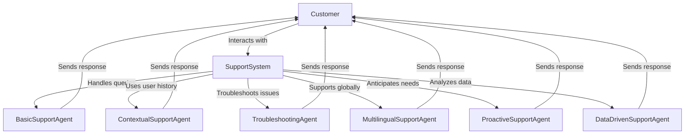
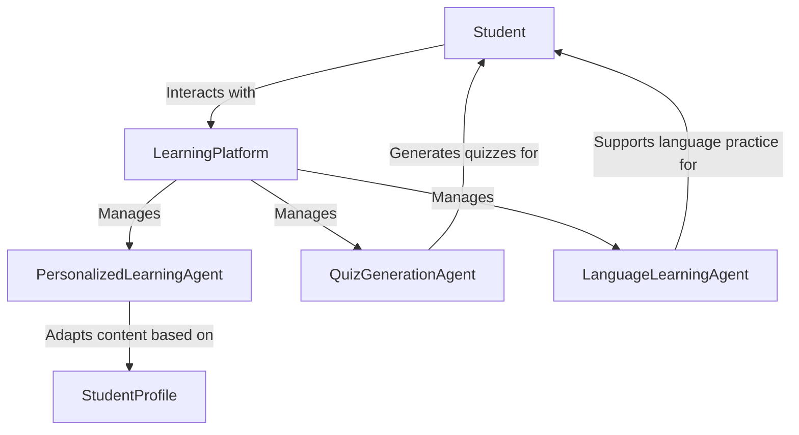
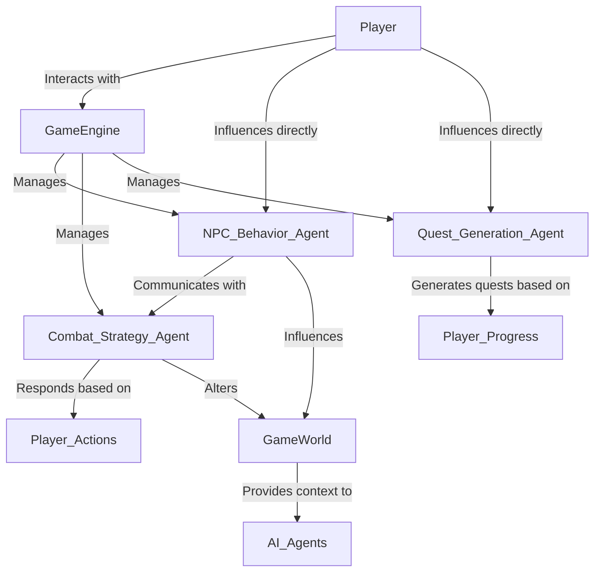

# Chapter 7: Practical Tutorials

## 7.1 Getting Started with Generative AI Agents

This chapter provides hands-on tutorials for building AI agents using various APIs, ensuring a balanced representation of OpenAI, Google Gemini or Anthropic Claude. We will cover step-by-step implementations for building single-agent and multi-agent systems.

## 7.2 Setting Up Your Environment

Before we dive into the tutorials, install the necessary dependencies:

```bash
pip install openai anthropic google-generativeai langchain
```

### API Keys
Obtain API keys from OpenAI (for the Agents SDK & Responses API), Anthropic (Claude API), and Google (Gemini API) for open-source LLMs.

## 7.3 Empowering Customer Experiences with AI Support Agents

### **Learning Outcome**
By the end of this tutorial, you will have a fully functional AI chatbot capable of handling customer queries efficiently. The chatbot will be implemented using **OpenAI’s Agents SDK**, **Gemini API**, and **Claude API**, with both **Python and JavaScript examples**.



The diagram illustrates a **Customer Support System** powered by various specialized AI agents, all designed to enhance the customer experience. At the center is the **Support System**, which manages multiple agents, each focusing on distinct aspects of customer support. The **Basic Support Agent** handles straightforward queries, providing quick, standardized responses. The **Contextual Support Agent** leverages user history to offer personalized assistance, improving engagement for repeat customers. For technical issues, the **Troubleshooting Agent** steps in, diagnosing problems and guiding users through solutions. To support a global audience, the **Multilingual Support Agent** delivers responses in multiple languages, ensuring accessibility. The **Proactive Support Agent** anticipates customer needs by analyzing behavior patterns, offering proactive assistance even before issues arise. Lastly, the **Data-Driven Support Agent** analyzes trends and historical data to deliver insightful, informed responses. Each of these agents communicates seamlessly with the customer, ensuring a comprehensive, responsive support system.

### **7.3.1 Basic Customer Support Chatbot**
Handles FAQs and basic queries.

**Python**
```python
from openai import OpenAI

# Initialize OpenAI with the API key
client = OpenAI(
  api_key='OPENAI_API_KEY',
)

def basic_support(query):
    try:
        response = client.chat.completions.create(
            model="gpt-4o-mini",
            messages=[
                {"role": "system", "content": "You are a basic customer support chatbot for an online store."},
                {"role": "user", "content": query}
            ]
        )
        print("Chatbot:", response.choices[0].message.content)
    except Exception as e:
        print("Error:", e)

basic_support("What is your return policy?")
```

**JavaScript**
```javascript
import { OpenAI } from "openai";

const openai = new OpenAI({ apiKey: 'OPENAI_API_KEY' });

async function basicSupport(query) {
    try {
        const response = await openai.chat.completions.create({
            model: "gpt-4o-mini",
            messages: [
                { role: "system", content: "You are a basic customer support chatbot for an online store." },
                { role: "user", content: query }
            ]
        });
        console.log("Chatbot:", response.choices[0].message.content);
    } catch (error) {
        console.error("Error:", error);
    }
}

basicSupport("What is your return policy?");
```

- **Focus**: Simple, rule-based responses for common questions.

- **Key Point**: Great for handling repetitive queries quickly.

### **7.3.2 Advanced Support Agent with Contextual Awareness**
Remembers user interactions for a personalized experience.

**Python**
```python
from openai import OpenAI

# Initialize OpenAI with the API key
client = OpenAI(
  api_key='OPENAI_API_KEY'
)

def contextual_support(user_id, query):
    try:
        context = f"Previous interactions with user {user_id} include a complaint about delayed delivery."
        response = client.chat.completions.create(
            model="gpt-4o-mini",
            messages=[
                {"role": "system", "content": "You are an advanced support agent with contextual awareness."},
                {"role": "system", "content": context},
                {"role": "user", "content": query}
            ]
        )
        print("Advanced Agent:", response.choices[0].message.content)
    except Exception as e:
        print("Error:", e)

contextual_support("12345", "Can you update me on my refund status?")
```

**JavaScript**
```javascript
import { OpenAI } from "openai";

const openai = new OpenAI({ apiKey: "OPENAI_API_KEY" });

async function contextualSupport(userId, query) {
    try {
        const context = `Previous interactions with user ${userId} include a complaint about delayed delivery.`;
        const response = await openai.chat.completions.create({
            model: "gpt-4o-mini",
            messages: [
                { role: "system", content: "You are an advanced support agent with contextual awareness." },
                { role: "system", content: context },
                { role: "user", content: query }
            ]
        });
        console.log("Advanced Agent:", response.choices[0].message.content);
    } catch (error) {
        console.error("Error:", error);
    }
}

contextualSupport("", "Can you update me on my refund status?");
```
- **Focus**: Personalized responses based on user history.

- **Key Point**: Adds emotional intelligence and contextual understanding.

### **7.3.3 Troubleshooting Assistant for Technical Issues**
Guides users through technical problem-solving steps.

**Python**
```python
from openai import OpenAI

# Initialize OpenAI with the API key
client = OpenAI(
  api_key='OPENAI_API_KEY', 
)

def data_driven_support(query):
    try:
        response = client.chat.completions.create(
            model="gpt-4o-mini",
            messages=[
                {"role": "system", "content": "You are a data-driven support agent using analytics to provide insights."},
                {"role": "user", "content": query}
            ]
        )
        print("Data-Driven Support:", response.choices[0].message.content)
    except Exception as e:
        print("Error:", e)

data_driven_support("Why is my order delayed more than usual?")
```

**JavaScript**
```javascript
import { OpenAI } from "openai";

const openai = new OpenAI({ apiKey: "OPENAI_API_KEY" });

async function troubleshootingAssistant(issue) {
    try {
        const response = await openai.chat.completions.create({
            model: "gpt-4o-mini",
            messages: [
                { role: "system", content: "You are a technical support agent specializing in troubleshooting software issues." },
                { role: "user", content: issue }
            ]
        });
        console.log("Tech Support:", response.choices[0].message.content);
    } catch (error) {
        console.error("Error:", error);
    }
}

troubleshootingAssistant("My app crashes when I try to open it.");
```
- **Focus**: Step-by-step technical support.

- **Key Point**: AI breaks down complex issues into manageable troubleshooting steps.

### **7.3.4 Multilingual Customer Support Agent**
Handles queries in multiple languages, providing global support.

**Python**
```python
from openai import OpenAI

# Initialize OpenAI with the API key
client = OpenAI(
  api_key='OPENAI_API_KEY'
)

def multilingual_support(query, language="en"):
    try:
        response = client.chat.completions.create(
            model="gpt-4o-mini",
            messages=[
                {"role": "system", "content": f"You are a multilingual customer support agent, fluent in {language}."},
                {"role": "user", "content": query}
            ]
        )
        print("Multilingual Support:", response.choices[0].message.content)
    except Exception as e:
        print("Error:", e)

multilingual_support("¿Cómo puedo rastrear mi pedido?", "es")
```

**JavaScript**
```javascript
import { OpenAI } from "openai";

const openai = new OpenAI({ apiKey: "OPENAI_API_KEY" });

async function multilingualSupport(query, language = "en") {
    try {
        const response = await openai.chat.completions.create({
            model: "gpt-4o-mini",
            messages: [
                { role: "system", content: `You are a multilingual customer support agent, fluent in ${language}.` },
                { role: "user", content: query }
            ]
        });
        console.log("Multilingual Support:", response.choices[0].message.content);
    } catch (error) {
        console.error("Error:", error);
    }
}

multilingualSupport("¿Cómo puedo rastrear mi pedido?", "es");
```
- **Focus**: Global customer support in different languages.

- **Key Point**: AI’s ability to understand and respond in multiple languages efficiently.

### **7.3.5 Proactive Support Agent (Anticipates Issues)**
Provides proactive suggestions based on user behavior.

**Python**
```python
from openai import OpenAI

# Initialize OpenAI with the API key
client = OpenAI(
  api_key='OPENAI_API_KEY',
)

def proactive_support(user_behavior):
    try:
        response = client.chat.completions.create(
            model="gpt-4o-mini",
            messages=[
                {"role": "system", "content": "You are a proactive customer support agent who anticipates customer needs."},
                {"role": "user", "content": "I noticed you’ve been browsing our refund policy page."}
            ],
            max_tokens=200
        )
        print("Proactive Support:", response.choices[0].message.content)
    except Exception as e:
        print("Error:", e)

proactive_support("User browsing refund policy")
```

**JavaScript**
```javascript
import { OpenAI } from "openai";

const openai = new OpenAI({ apiKey: "OPENAI_API_KEY" });

async function proactiveSupport(userBehavior) {
    try {
        const response = await openai.chat.completions.create({
            model: "gpt-4o-mini",
            messages: [
                { role: "system", content: "You are a proactive customer support agent who anticipates customer needs." },
                { role: "user", content: `I noticed you’ve been browsing our refund policy page.` }
            ]
        });
        console.log("Proactive Support:", response.choices[0].message.content);
    } catch (error) {
        console.error("Error:", error);
    }
}

proactiveSupport();
```
- **Focus**: Predicts and addresses customer issues before they escalate.

- **Key Point**: Enhances customer satisfaction by anticipating needs.

### **7.3.6 Data-Driven Support Agent (Uses Analytics for Insights)**
Provides answers based on data trends and analytics.

**Python**
```python
from openai import OpenAI

# Initialize OpenAI with the API key
client = OpenAI(
  api_key='OPENAI_API_KEY',
)

def data_driven_support(query):
    try:
        response = client.chat.completions.create(
            model="gpt-4o-mini",
            messages=[
                {"role": "system", "content": "You are a data-driven support agent using analytics to provide insights."},
                {"role": "user", "content": query}
            ]
        )
        print("Data-Driven Support:", response.choices[0].message.content)
    except Exception as e:
        print("Error:", e)

data_driven_support("Why is my order delayed more than usual?")
```

**JavaScript**
```javascript
import { OpenAI } from "openai";

const openai = new OpenAI({ apiKey: "OPENAI_API_KEY" });

async function dataDrivenSupport(query) {
    try {
        const response = await openai.chat.completions.create({
            model: "gpt-4o-mini",
            messages: [
                { role: "system", content: "You are a data-driven support agent using analytics to provide insights." },
                { role: "user", content: query }
            ]
        });
        console.log("Data-Driven Support:", response.choices[0].message.content);
    } catch (error) {
        console.error("Error:", error);
    }
}

dataDrivenSupport("Why is my order delayed more than usual?");
```
- **Focus**: Uses data trends to explain patterns, such as delays or outages.

- **Key Point**: Leverages historical data for more informed responses.

### **Alternative: Using Google Gemini API for the Chatbot**
- Gemini API can be used for a more **multi-modal approach**, integrating text, images, and videos.

### **Alternative: Using Claude API for the Chatbot**
- Claude specializes in **structured conversations with high reliability**.

## 7.4  Generative AI Agents in Education & E-Learning ##

### **Learning Outcome**
By the end of these tutorials, you will learn how to create Generative AI agents for personalized learning, dynamic quiz generation, and language learning support. You’ll gain hands-on experience with tools like LangChain and OpenAI’s API, enabling you to build interactive, adaptive educational applications. Additionally, you’ll understand how to structure AI agents for scalability and apply them effectively in diverse e-learning environments.



**Student interacts with the Learning Platform, which serves as the central hub.

The platform manages three AI agents:

- **Personalized Learning Agent** adapts educational content based on the student’s profile and learning preferences.

- **Quiz Generation Agent** creates dynamic quizzes tailored to the student’s progress and topic mastery.

- **Language Learning Agent** provides interactive language practice, including vocabulary, grammar, and conversational exercises.

Each agent interacts with the student in a way that enhances personalized learning outcomes.

### **7.4.1 Personalized Learning Assistant**
This tutorial focuses on creating a Personalized Learning Assistant using Generative AI. The assistant adapts learning content based on the student’s pace, preferences, and performance.

**Python**
```python
from langchain_openai import ChatOpenAI
from langchain.prompts import PromptTemplate
from langchain.chains import LLMChain

openai_api_key = 'OPENAI_API_KEY'

# Initialize Chat Model
chat_model = ChatOpenAI(model_name="gpt-4o-mini", openai_api_key=openai_api_key)

# Define Prompt Template
prompt = PromptTemplate(
    input_variables=["topic", "learning_level"],
    template="You are a personalized learning assistant. The student is at {learning_level} level. Explain the topic '{topic}' in a simple, engaging way."
)

# Initialize LLMChain
learning_chain = LLMChain(llm=chat_model, prompt=prompt)

# Function to get personalized learning content
def personalized_learning(topic, learning_level="beginner"):
    response = learning_chain.run(topic=topic, learning_level=learning_level)
    print("Learning Assistant Response:", response)

# Example Usage
personalized_learning("Basics of the Solar System", learning_level="intermediate")
```

**JavaScript**
```javascript
import { ChatOpenAI } from "@langchain/openai";
import { PromptTemplate } from "@langchain/core/prompts";
import { LLMChain } from "langchain/chains";

const chatModel = new ChatOpenAI({
    modelName: "gpt-4o-mini",
    openai_api_key: 'OPENAI_API_KEY',
});

const prompt = new PromptTemplate({
    template: "You are a personalized learning assistant. The student is at {learning_level} level. Explain the topic '{topic}' in a simple, engaging way.",
    inputVariables: ["topic", "learning_level"],
});

const learningChain = new LLMChain({ llm: chatModel, prompt: prompt });

// Function to get personalized learning content
async function personalizedLearning(topic, learningLevel = "beginner") {
    try {
        const response = await learningChain.invoke({ topic, learning_level: learningLevel });
        console.log("Learning Assistant Response:", response);
    } catch (error) {
        console.error("Error:", error);
    }
}

// Example Usage
personalizedLearning("Basics of the Solar System", "intermediate");
```

### **7.4.2 Automated Quiz Generator**
This tutorial focuses on creating an Automated Quiz Generator using Generative AI. The system generates quizzes based on learning content, adapting to different difficulty levels and formats.

**Python**
```python
from openai import OpenAI

# Initialize OpenAI with the API key
client = OpenAI(
  api_key='OPENAI_API_KEY',  
)

# Automated Quiz Generator
def generate_quiz(topic, difficulty="medium"):
    try:
        response = client.chat.completions.create(
            model="gpt-4o-mini",
            messages=[
                {"role": "system", "content": "You are an automated quiz generator that creates quizzes on educational topics."},
                {"role": "user", "content": f"Generate a {difficulty} difficulty quiz on '{topic}' with 5 questions, including multiple-choice and true/false questions."}
            ],
            max_tokens=300
        )
        print("Generated Quiz:\n", response.choices[0].message.content)
    except Exception as e:
        print("Error:", e)

# Example Usage
generate_quiz("The Solar System", difficulty="easy")
```

**JavaScript**
```javascript
import { OpenAI } from "openai";

const openai = new OpenAI({ apiKey: 'OPENAI_API_KEY' });

// Automated Quiz Generator
async function generateQuiz(topic, difficulty = "medium") {
    try {
        const response = await openai.chat.completions.create({
            model: "gpt-4o-mini",
            messages: [
                { role: "system", content: "You are an automated quiz generator that creates quizzes on educational topics." },
                { role: "user", content: `Generate a ${difficulty} difficulty quiz on '${topic}' with 5 questions, including multiple-choice and true/false questions.` }
            ],
            max_tokens: 300
        });
        console.log("Generated Quiz:\n", response.choices[0].message.content);
    } catch (error) {
        console.error("Error:", error);
    }
}

// Example Usage
generateQuiz("The Solar System", "easy");
```

### **7.4.3 Language Learning Assistant**
This tutorial focuses on creating a Language Learning Assistant using Generative AI. The assistant helps users practice vocabulary, grammar, and conversational skills in a target language.

**Python**
```python
from openai import OpenAI

# Initialize OpenAI with the API key
client = OpenAI(
  api_key='OPENAI_API_KEY',  
)

# Language Learning Assistant
def language_practice(topic, language="Spanish", skill_level="beginner"):
    try:
        response = client.chat.completions.create(
            model="gpt-4o-mini",
            messages=[
                {"role": "system", "content": f"You are a language learning assistant specializing in {language}. You help users practice vocabulary, grammar, and conversations based on their skill level."},
                {"role": "user", "content": f"Help me practice {topic} in {language} at a {skill_level} level."}
            ],
            max_tokens=200
        )
        print("Language Assistant Response:", response.choices[0].message.content)
    except Exception as e:
        print("Error:", e)

# Example Usage
language_practice("ordering food", language="French", skill_level="intermediate")
```

**JavaScript**
```javascript
import { OpenAI } from "openai";

const openai = new OpenAI({ apiKey: 'OPENAI_API_KEY' });

// Language Learning Assistant
async function languagePractice(topic, language = "Spanish", skillLevel = "beginner") {
    try {
        const response = await openai.chat.completions.create({
            model: "gpt-4o-mini",
            messages: [
                { role: "system", content: `You are a language learning assistant specializing in ${language}. You help users practice vocabulary, grammar, and conversations based on their skill level.` },
                { role: "user", content: `Help me practice ${topic} in ${language} at a ${skillLevel} level.` }
            ],
            max_tokens: 200
        });
        console.log("Language Assistant Response:", response.choices[0].message.content);
    } catch (error) {
        console.error("Error:", error);
    }
}

// Example Usage
languagePractice("ordering food", "French", "intermediate");
```

### **Alternative: Using Google Gemini API for Content Generation**
- Gemini API provides multi-modal creativity by integrating text, images, and video generation into content workflows.

### **Alternative: Using Claude API for Structured Content Writing**
- Claude excels in creating **coherent, structured, and well-formed content** across different domains.

In these tutorials, we've explored how Generative AI agents can transform the landscape of education and e-learning. From personalized learning assistants that adapt content to individual needs, to dynamic quiz generators and language learning companions, these AI-driven tools are redefining how knowledge is delivered and engaged with. By leveraging frameworks like LangChain and OpenAI’s latest models, we've demonstrated practical implementations that showcase both the versatility and potential of AI in enhancing educational experiences. As you continue to experiment and build upon these examples, you'll find endless possibilities to create more interactive, responsive, and personalized learning environments.

## 7.7 Designing Dynamic Games with AI-Powered Agents

### **Learning Outcome**
By the end of this tutorial, you will learn to develop AI-powered game features (NPCs, quests, combat strategies).

### **Understanding AI Agents in Gaming**
AI agents in gaming are autonomous entities that make decisions, adapt to changing environments, and interact with players or other agents to create dynamic and immersive experiences. Unlike simple scripted behaviors, AI agents can learn, strategize, and respond in real-time.

**Key Types of AI Agents in Gaming**
- **NPC Behavior Agent**: Controls non-playable characters (NPCs) to create lifelike interactions.
- **Combat Strategy Agent**: Determines optimal attack/defense strategies during combat.
- **Environment Interaction Agent**: Adapts the game world dynamically based on AI decisions.
- **Dynamic Quest Generation Agent**: Creates unique quests based on player progression and in-game events.
- **AI-Powered Enemy Behavior Agent**: Simulates intelligent enemy behavior that adapts over time.
- **Storytelling and Memory Agent**: Enhances narrative depth by remembering past player actions.

The diagram below illustrates the dynamic interactions between the player, game engine, AI agents, and the game world. The player engages with the game engine, which manages various AI agents, including the NPC Behavior Agent, Combat Strategy Agent, and Quest Generation Agent. These agents operate autonomously but also communicate with each other—for example, the NPC Behavior Agent interacts with the Combat Strategy Agent to create cohesive gameplay experiences. Player actions directly influence AI agents, shaping NPC behaviors and quest outcomes, while the AI agents respond based on real-time game contexts. Additionally, the agents actively influence the game world, altering environments, strategies, and narratives based on decisions made during gameplay.



**Note:** The tutorials provided below focus on specific types of AI agents within this system, such as NPC behavior, combat strategies, and dynamic quest generation. They do not cover the full range of agents or the complete game architecture depicted in the diagram. This overview serves to illustrate how these agents fit into a broader, dynamic gaming environment.

### **7.7.1 AI-Powered NPC Behaviour**
**Python**
```python
from openai import OpenAI

client = OpenAI(api_key="YOUR_API_KEY")

def npc_behavior(npc_role):
    response = client.beta.threads.create_and_run(
        assistant_id="your_npc_id",
        thread={"messages": [{"role": "user", "content": f"What should {npc_role} do in battle?"}]}
    )
    return response

print(npc_behavior("Warrior"))
```

**JavaScript**
```javascript
import { OpenAI } from "openai";

const openai = new OpenAI({ apiKey: "YOUR_API_KEY" });

async function npcBehavior(npcRole) {
    const response = await openai.beta.threads.createAndRun({
        assistant_id: "your_npc_id",
        thread: { messages: [{ role: "user", content: `What should ${npcRole} do in battle?` }] },
    });
    console.log(response);
}

npcBehavior("Warrior");
```

### **7.7.2 Autonomous NPC with Basic Decision-Making**
**Python**
```python
from openai import OpenAI

# Initialize OpenAI with the API key
client = OpenAI(
  api_key='OPENAI_API_KEY',  
)

def npc_agent(state):
    try:
        response = client.chat.completions.create(
            model="gpt-4o-mini",
            messages=[
                {"role": "system", "content": "You are an NPC in a survival game with goals to stay alive and gather resources."},
                {"role": "user", "content": f"Current state: {state}. What should the NPC do next?"}
            ]
        )
        action = response.choices[0].message.content
        print("NPC Action:", action)
        return action
    except Exception as error:
        print("Error:", error)

# Example scenario
npc_agent("Low health, near a water source, with no food")
```

**JavaScript**
```javascript
import { OpenAI } from "openai";

const openai = new OpenAI({ apiKey: "OPENAI_API_KEY" });

async function npcAgent(state) {
    const response = await openai.chat.completions.create({
        model: "gpt-4o-mini",
        messages: [
            { role: "system", content: "You are an NPC in a survival game with goals to stay alive and gather resources." },
            { role: "user", content: `Current state: ${state}. What should the NPC do next?` }
        ]
    });

    const action = response.choices[0].message.content;
    console.log("NPC Action:", action);
    return action;
}

// Example scenario
npcAgent("Low health, near a water source, with no food");
```
- The NPC is making autonomous decisions based on its state, aiming to survive.
- It could be extended to have memory (remembering past states) or a goal system.

### **7.7.3 AI Agent for Dynamic Quest Generation (with Decision Tree)**
**Python**
```python
from openai import OpenAI

# Initialize OpenAI with the API key
client = OpenAI(
  api_key='OPENAI_API_KEY',  
)

def quest_agent(player_level):
    try:
        response = client.chat.completions.create(
            model="gpt-4o-mini",
            messages=[
                {"role": "system", "content": "You are an AI quest designer. Generate a quest suitable for the player's level."},
                {"role": "user", "content": f"Player is at level {player_level}. Design a challenging quest."}
            ]
        )
        quest = response.choices[0].message.content
        print("Quest:", quest)
        return quest
    except Exception as error:
        print("Error:", error)

# Simulate dynamic quest creation
quest_agent(15)
```

**JavaScript**
```javascript
import { OpenAI } from "openai";

const openai = new OpenAI({ apiKey: "OPENAI_API_KEY" });

async function questAgent(playerLevel) {
    const response = await openai.chat.completions.create({
        model: "gpt-4o-mini",
        messages: [
            { role: "system", content: "You are an AI quest designer. Generate a quest suitable for the player's level." },
            { role: "user", content: `Player is at level ${playerLevel}. Design a challenging quest.` }
        ]
    });

    console.log("Quest:", response.choices[0].message.content);
    return response.choices[0].message.content;
}

// Simulate dynamic quest creation
questAgent(15);
```
- The agent adapts the quest based on the player’s level, dynamically adjusting the difficulty.
- This can be expanded into an AI-driven quest system that evolves as the player progresses.

### **7.7.4 AI Agent for Tactical Combat Strategy**
**Python**
```python
from openai import OpenAI

# Initialize OpenAI with the API key
client = OpenAI(
  api_key='OPENAI_API_KEY',  
)

def combat_agent(enemy_status, player_status):
    try:
        response = client.chat.completions.create(
            model="gpt-4o-mini",
            messages=[
                {"role": "system", "content": "You are an AI strategist for a tactical combat game."},
                {"role": "user", "content": f"Enemy Status: {enemy_status}, Player Status: {player_status}. What should the player do next?"}
            ]
        )
        strategy = response.choices[0].message.content
        print("Combat Strategy:", strategy)
        return strategy
    except Exception as error:
        print("Error:", error)

# Example combat scenario
combat_agent("Low health, strong position", "Full health, flanking opportunity")
```

**JavaScript**
```javascript
import { OpenAI } from "openai";

const openai = new OpenAI({ apiKey: "OPENAI_API_KEY" });

async function combatAgent(enemyStatus, playerStatus) {
    const response = await openai.chat.completions.create({
        model: "gpt-4o-mini",
        messages: [
            { role: "system", content: "You are an AI strategist for a tactical combat game." },
            { role: "user", content: `Enemy Status: ${enemyStatus}, Player Status: ${playerStatus}. What should the player do next?` }
        ]
    });

    console.log("Combat Strategy:", response.choices[0].message.content);
    return response.choices[0].message.content;
}

// Example combat scenario
combatAgent("Low health, strong position", "Full health, flanking opportunity");
```
- The agent is making decisions in real-time based on combat conditions.
- It can be enhanced with reinforcement learning or simulation-based decision-making for more complex strategies.

### **7.7.5 AI Agent with Simple Memory for Storytelling**
**Python**
```python
from openai import OpenAI

# Initialize OpenAI with the API key
client = OpenAI(
  api_key='OPENAI_API_KEY',  
)

# Simple memory implementation
npc_memory = []

def story_agent(player_action):
    npc_memory.append(player_action)
    try:
        response = client.chat.completions.create(
            model="gpt-4o-mini",
            messages=[
                {"role": "system", "content": "You are a storyteller NPC who remembers the player's actions."},
                {"role": "user", "content": f"Player just {player_action}. Recall their previous actions and respond."},
                {"role": "assistant", "content": f"Previous actions: {', '.join(npc_memory)}."}
            ]
        )
        story_response = response.choices[0].message.content
        print("Story Response:", story_response)
        return story_response
    except Exception as error:
        print("Error:", error)

# Example interactions
story_agent("saved a village from bandits")
story_agent("helped a merchant find lost goods")
```

**JavaScript**
```javascript
import { OpenAI } from "openai";

const openai = new OpenAI({ "OPENAI_API_KEY" });

const npcMemory = [];

async function storyAgent(playerAction) {
    npcMemory.push(playerAction);

    const response = await openai.chat.completions.create({
        model: "gpt-4o-mini",
        messages: [
            { role: "system", content: "You are a storyteller NPC who remembers the player's actions." },
            { role: "user", content: `Player just ${playerAction}. Recall their previous actions and respond.` },
            { role: "assistant", content: `Previous actions: ${npcMemory.join(", ")}.` }
        ]
    });

    console.log("Story Response:", response.choices[0].message.content);
    return response.choices[0].message.content;
}

storyAgent("saved a village from bandits");
storyAgent("helped a merchant find lost goods");
```
- The agent has memory of past interactions, allowing it to build a narrative thread over time.
- This leads to personalized, evolving interactions with the player.

### **How to Build More Advanced AI Agents for gaming?**
- **Reinforcement Learning (RL):** Combine LLMs with RL for agents that learn from gameplay.
- **Memory & State Management:** Use databases or in-memory stores to manage persistent state.
- **Multi-Agent Systems:** Implement AI agents that interact with each other, simulating complex ecosystems.

### **Alternative Approaches**
- **Google Gemini API**: For dynamic character dialogues and real-time adaptations.
- **Claude API**: Best suited for **scripted AI interactions** and procedural storytelling.

This AI-driven gaming system can be integrated into **RPGs, strategy games, and dynamic simulations**.

---

This chapter introduced practical tutorials for building AI agents using multiple APIs, covering OpenAI’s Agents SDK, LangChain, and AutoGen for real-world applications. The next chapter will explore ethical considerations, privacy, and limitations in deploying AI agents.


---

[Previous: Chapter 6](https://github.com/FrugalX/ai_agents_ebook_draft/blob/main/Chapter%206%20Key%20Concepts%20in%20Generat.md) | [Next: Chapter 8](https://github.com/FrugalX/ai_agents_ebook_draft/blob/main/Chapter%208%20Ethics%2C%20Privacy%2C%20and%20Li.md)
